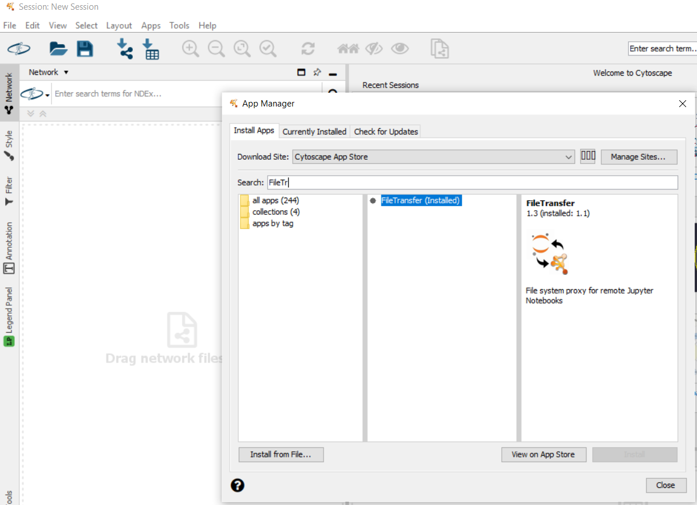
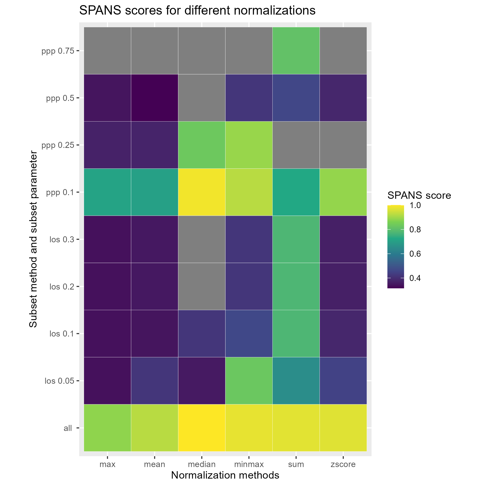

# MetaboDirect Tutorial

## Introduction

MetaboDirect is a Python and R based pipeline for the analysis of Direct Injection FT-ICR Mass Spectrometry data. More detailed information of each function of MetaboDirect can be seen in its [User Guide](https://metabodirect.readthedocs.io/en/latest/).
### Citation
MetaboDirect's paper is currently under review, in the meanwhile please cite our [preprint](https://www.biorxiv.org/content/10.1101/2022.06.10.495699v1).
- Ayala-Ortiz, C. O., Graf-Grachet, N., Freire-Zapata, V., Fudyma, J., Hildebrand, G., AminiTabrizi, R., ... & Tfaily, M. (2022). MetaboDirect: An Analytical Pipeline for the processing of FTICR-MS-based Metabolomics Data. bioRxiv.

## Installation

### 1. Installing Anaconda

Any Python installation can work with MetaboDirect, however we recommend using the Anaconda distribution. 

Download and install the Anaconda distribution of Python from [here](https://www.anaconda.com/products/individual-b).

### (Optional) Setting up the terminal

**(For Windows Users)** Open the *Anaconda Prompt* in Administrator Mode, and enter the following commands:

```
conda install m2-base
conda install -c menpo wget
```

### 2. Installing required Python Modules

Open a terminal and install the required packages specified in the MetaboDirect [installation page](https://metabodirect.readthedocs.io/en/latest/installation.html), using the following command:

```
pip install <package-name>
```

### 3. Installing R/RStudio

MetaboDirect creates and runs R scripts as part of its normal run. 

The R software for statistical computing can be download from [here](https://cran.r-project.org/mirrors.html).

After running MetaboDirect you can access the R scripts to modify any figures or tables. We recommend using RStudio for modifying any R script. RStudio can be download from [here](https://www.rstudio.com/products/rstudio/download/).

### 4. Installing R packages

Open R or RStudio and install the required packages specified in the MetaboDirect [installation page](https://metabodirect.readthedocs.io/en/latest/installation.html):

```
install.packages('<package-name>') 
```
The packages *KEGGREST* needs to be installed from Bioconductor with the following command:

```
if (!requireNamespace("BiocManager", quietly = TRUE))
    install.packages("BiocManager")

BiocManager::install("KEGGREST")
```

The package *pmartR* needs to be installed with *devtools* with the following command:

```
devtools::install_github("pmartR/pmartR")
```

Please check each package documentation for more detailed information regarding installation.

### 5. Put R in your system's PATH

Check i R is in your path by typing the following in the command prompt

```
which Rscript
```

If you get and error, R is not in your path:

**(For Windows Users)** Please follow the instructions detailed [here](https://hackmd.io/0rnQHQDyT4yQy_PFnxZhTQ?view) to add the directory where R is installed to your system's path.

**(For Mac Users)** Most likely R will be already in your path. If not, you can follow the instructions of this [website](https://www.architectryan.com/2012/10/02/add-to-the-path-on-mac-os-x-mountain-lion/)

### 7. Installing Cytoscape

Cytoscape is used by MetaboDirect to build the biochemical transformation networks. It can be downloaded from [here](https://cytoscape.org/download.html).

### 8. Installing Cytoscape plugin

The FileTransfer plugin for Cytoscape is required to run MetaboDirect. This plugin can be installed by searching FileTransfer in `Apps -> App Manager` and then clicking on the "Install" button.

<p align="center">
  
</p>

### 6. Example using test data

#### 6.1. Downloading the test data

Create a new directory (`metabodirect_tutorial`) in your home directory to download the data and run MetaboDirect.

```
cd ~
mkdir metabodirect_tutorial
cd metabodirect_tutorial
```

Example data can be downloaded from the MetaboDirect repository, using the following command:

**Report file**

```
curl https://raw.githubusercontent.com/Coayala/metabodirect_tutorial/main/tutorial_data/Report.csv -o Report.csv
```
**Metadata file**

```
curl https://raw.githubusercontent.com/Coayala/metabodirect_tutorial/main/tutorial_data/metadata.csv -o metadata.csv
```
#### 6.2. Check the normalization methods

MetaboDirect can help to choose the best normalization method for an specific dataset and an specific grouping variable using the [SPANS method](https://doi.org/10.1002/rcm.9068). This can be done with the following command:

```
test_normalization Report.csv metadata.csv Treatment
```

This command will create the file `SPANS_score.R` as well as a heatmap with the SPANS score of several normalization methods. Methods with higher scores are considered to best represent the differences found in the datasets.

<p align="center">
  
</p>

In the example the best normalization method seem to be `median`. For more information about normalization methods check the corresponding [Normalization methods section of the User Guide](https://metabodirect.readthedocs.io/en/latest/use_guide.html#normalization-method-n-norm-method).

#### 6.3 Run the MetaboDirect pipeline

MetaboDirect can be run with the selected normalization method as follows:

```
metabodirect Report.csv metadata.csv -o tutorial_run -g Treatment -n median -t
```

This command will create a directory called `tutorial_run` which will have all the tables and plots of the different analysis performed by MetaboDirect, as well as R scripts to modify them.

<p align="center">
  
  
</p>

#### 6.3 Biochemical transformation networks

In the previous step we run MetaboDirect with the option `-t` which will calculate possible biochemical transformations for the detected masses based on mass differences, tables with the possible transformations will be generated in the directory `tutorial_run/6_transformations`.

The biochemical transformation networks can be build using Cytoscape with the following command:

```
create_networks tutorial_run metadata.csv Treatment
```


